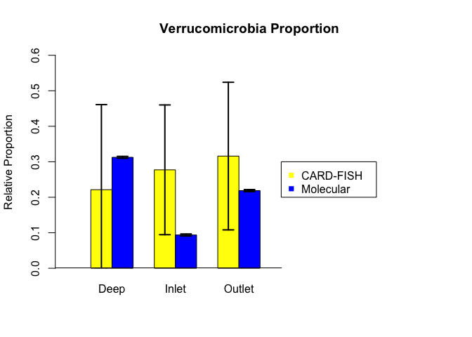

# Comparison of *Verrucomicrobia* proportion calculated from CARD-FISH and molecular data
Edna Chiang  
October 22, 2014  


### Introduction
  For my senior honors thesis, I am studying the distribution and lifestyle of the bacterial phylum *Verrucomicrobia* in the Great Lakes. Species of *Verrucomicrobia* have been found to be involved in complex carbon breakdown as well as methane oxidation, which suggest that they play a role in the carbon cycle^1,2^. The majority of *Verrucomicrobia* studies have been conducted in soil where they are a ubiquitous and abundant group^3^. They were first observed and later isolated from aquatic systems^4,5,6^; however, very few freshwater studies have been conducted and much remains to be learned regarding their ecology, niche, and function in the ecosystem^7^.
  
  The majority of my data will be generated from DNA sequencing; however, due to the potential for bias in the molecular data, I will complement it with catalyzed reporter deposition in-situ hybridization (CARD-FISH), analysis to generate the most accurate results possible. I spent the past year optimizing CARD-FISH, and will now compare it to the molecular data. My question is whether the proportion of *Verrucomicrobia* reported by the two methods are similar.


### Methods
  Samples were collected during a sampling cruise in May 2014 conducted in collaboration with the Grand Valley State University Annis Water Resources Center. 2 L of water was collected in Van Dorn Water Samplers at varying depths in Muskegon Lake in three locations: the river inlet, the estuary outlet, and the deepest point of the lake. The water was first pre-filtered through 210 μm and 20 μm to remove debris. 20 mL of this filtrate was collected and stored on ice or in a 4°C refrigerator for less than 24 hrs before being filtered back in the lab. CARD-FISH was performed on these filters. Probes EUB 338, EUB 338 II, and EUB 338 III were used to tag bacterial cells. *Verrucomicrobia* was targeted by mixing EUB 338 II and unlabeled EUB 338 III. The nonsense probe NONEUB (NON338) was used as a control. Filters were counterstained with DAPI to identify all cells. The filters were then examined with fluorescence microscopy. To count cells stained by DAPI and tagged by the probes, a photo was taken and a minimum of 1000 cells was counted per labeled filter.
  
  
   The remaining pre-filtered was pumped through a 3 μm and 0.22 μm filter, which, respectively, captured particle-associated and free-living microorganisms. These filters were stored in liquid nitrogen and, upon returning to the lab, in an -80°C refrigerator. The Qiagen AllPrep DNA Extraction Kit was used to extract DNA from the filters. Subsequently. The 16S rRNA V4 region was Ilumina MiSeq tag-sequenced at the University of Michigan, and analyzed using Mothur and RStudio.


### Results

First, I calculated the total number of counted cells.

```
##          Deep Inlet Outlet
## Cells    1082  1197   1072
## Bacteria  545   925    653
```

```
##                 Deep Inlet Outlet
## Cells           1238  1512   1065
## Verrucomicrobia  138   324    205
```


Using the total counts, the area of the field that I counted, and the volume of water filtered, I determined the number of cells/mL.

```
##                Deep   Inlet  Outlet
## Cells/mL    2037715 3272155 1221830
## Bacteria/mL 1026391 2528607  744268
```

```
##                       Deep   Inlet  Outlet
## Cells/mL           1637027 3580261 1036973
## Verrucomicrobia/mL  182480  767199  199605
```


Next, I calculated the proportion of bacterial and verrucomicrobial cells compared to overall cells.

```
##                    Deep  Inlet Outlet
## Bacteria/Cells   0.5037 0.7728 0.6091
## Verruco/Cells    0.1115 0.2143 0.1925
## Verruco/Bacteria 0.1778 0.3034 0.2682
```


The proportion of *Verrucomicrobia* compared to Bacteria seemed odd. If Bacteria accounted for 50% of all cells, and *Verrucomicrobia* for 11% of all cells, I would expect the proportion of Verrucomicrobia to Bacteria to be roughly 20%; however, using absolute counts, this is lower at 17%. To better compare the two groups, I calculated the relative proportion of *Verrucomicrobia* with respect to the proportion of Bacteria.

```
##                    Deep  Inlet Outlet
## Verruco/Bacteria 0.2213 0.2773  0.316
```


To determine whether the absolute and relative proportions of *Verrucomicrobia* are significantly different, I performed a test of proportions.

H0 = The absolute and relative proportions of *Verrucomicrobia* are not significantly different.

```
## Warning: Chi-squared approximation may be incorrect
```

```
## 
## 	3-sample test for equality of proportions without continuity
## 	correction
## 
## data:  Abs.Rel
## X-squared = 0.0071, df = 2, p-value = 0.9964
## alternative hypothesis: two.sided
## sample estimates:
## prop 1 prop 2 prop 3 
## 0.4455 0.5225 0.4591
```
Because the p-value is very large (0.9964), I do not reject H0. The relative and absolute proportions of *Verrucomicrobia* are not significantly different.


For my remaining calculations, I will use the relative proportion of *Verrucomicrobia*.


To determine whether the *Verrucomicrobia* proportion calculated from CARD-FISH differs from the proportion calculated from tag sequencing, I performed another test of proportions.
The sequencing proportions are rounded from preliminary calculations done by Marian over the summer.

H0 = The *Verrucomicrobia* proportion calculated from CARD-FISH does not differ from that calculated from the molecular data.


```
## Warning: Chi-squared approximation may be incorrect
```

```
## 
## 	3-sample test for equality of proportions without continuity
## 	correction
## 
## data:  Tag.compare
## X-squared = 0.1009, df = 2, p-value = 0.9508
## alternative hypothesis: two.sided
## sample estimates:
## prop 1 prop 2 prop 3 
## 0.4145 0.7473 0.5909
```
The p-value is very large (0.9508), so the proportions of *Verrucomicrobia* calculated from CARD-FISH and molecular data are not significantly different.


To help visualize the data, I plot the CARD-FISH and tag sequencing proportions with error bars.
 


Those error bars are pretty knarly; so I decided to calculate the power for Deep, Inlet, and Outlet proportions. Because the CARD-FISH and molecular data have a different number of observations, I used the smaller observation number (CARD-FISH) to calculate power.


**Deep**

```
## 
##      Two-sample comparison of proportions power calculation 
## 
##               n = 5
##              p1 = 0.2213
##              p2 = 0.3126
##       sig.level = 0.05
##           power = 0.05024
##     alternative = two.sided
## 
## NOTE: n is number in *each* group
```


Power = 0.050


**Inlet**

```
## 
##      Two-sample comparison of proportions power calculation 
## 
##               n = 3
##              p1 = 0.2773
##              p2 = 0.09375
##       sig.level = 0.05
##           power = 0.07753
##     alternative = two.sided
## 
## NOTE: n is number in *each* group
```


Power = 0.078


**Outlet**

```
## 
##      Two-sample comparison of proportions power calculation 
## 
##               n = 6
##              p1 = 0.316
##              p2 = 0.2188
##       sig.level = 0.05
##           power = 0.05603
##     alternative = two.sided
## 
## NOTE: n is number in *each* group
```


Power = 0.056

### Discussion


Based on my data, the absolute and relative proportions of *Verrucomicrobia* are not significantly different; neither are the proportions calculated from CARD-FISH versus molecular data. However, my bar plot illustrates that while the proportions from CARD-FISH and molecular data are different, the CARD-FISH error bars are extremely large. This reveals a critical shortcoming in my data: my CARD-FISH counts are based on an extremely small observation size. Although I counted a large number of cells on each labeled filter (over 1000), the number of observations for each labeled filter is between 3 and 6. As a result, my standard deviation is extremely large. 


This shortcoming is also reflected in the powers I calculated for Deep, Inlet, and Outlet. The power is less than 0.1 in all three cases; consequently, it is very likely that I have Type II error.


To remedy this, I should increase the number of observations by counting more fields. This may result in drasticly different results when running tests of proportions. For example, when looking at the inlet proportions on the bar plot, the CARD-FISH error bar just barely overlaps with the molecular data error bar and proportion. I hypothesize that if I increase the number of CARD-FISH observations, the proportion of *Verrucomicrobia* calculated from CARD-FISH versus molecular data will be significantly different.


Although I did not conduct any statistical analyses on this, I was surprised by the proportion of labeled bacterial cells compared to DAPI-stained cells. I do not expect the number of bacteria compared to the number of all cells to be equal due to the presence of Eukaryotes, Archeae, but at a first glance the proportion seems rather low. This could be caused by dead or lysed cells or an inability of the probe to permeate the cell membrane. It would be interesting to see if probes targeted towards gram-positive bacteria performed due to the added challenge of permeating the thick peptidoglycan layer.


For future directions, I would like to use CARD-FISH to examine *Verrucomicrobia* on a finer level and compare the distribution of its classes. Most importantly, I need to learn how to analyze molecular data in R so I do not have to constantly reply on help from Marian and Vincent. My senior thesis depends on this; so, in other words, I really need to step up my R game.


###References


1. Op den Camp H. *et al., Environ. Microbiol. Rep.* **1**, 293 (2009)


2. Khadem A. *et al., Microbiology* **156**, 1052 (2010)


3. Sangwan P. *et al., Appl. Environ. Microb.* **71**, 8402 (2005)


4. De Bont J. *et al., Antonie van Leeuwenhoek* **36**, 397 (1970)


5. Freitas S. *et al., ISME* **6**, 1499 (2012)


6. Hedlund B. *et al., Antonie van Leeuwenhoek* **72**, 29 (1997)


7. Newton R. *et al., Microbiol. Mol. Biol. Rev.* **71**, 14 (2011)


